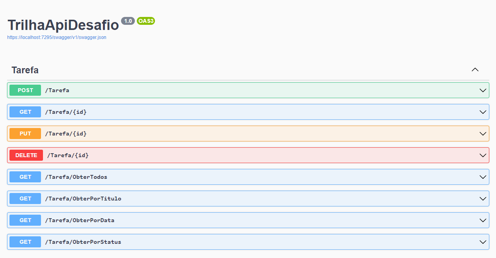
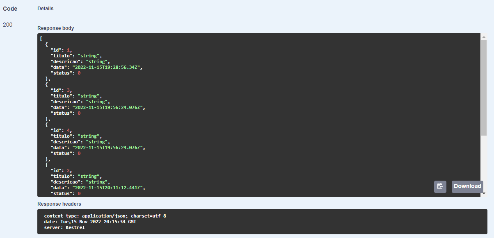

# 💻 | C# - DIO.

### Projeto: Construindo um Sistema para um Estacionamento com C#.

Seja bem vindo, aqui é totalmente para meus estudos e aperfeiçoamento como profissional. ❤️

- Colocando em prática conceitos obtidos durante a aula, nada de outro mundo apenas apresentando conceitos básicos e outros.
- Utilizando a linguagem C#.

### 🎬 | Preview:
Foi inserido o que se pedia nos comentarios TODO.

Os endpoint esperados estão funcinando perfeitamente e fiz a mudanção do meu banco para o PostgreSQL(Minha preferência).

Todas solicitações como GET, POST, PUT e DELETE que correspondem como CREATE, READ, UPDATE e DELETE (CRUD) estão funcionando perfeitamente como solicitado.

### 📸 | Screenshots:

<b>Segue a lista de commits para verificar o que foi alterado e incrementado!</b>

<b>[Certificado do Projeto](https://www.dio.me/certificate/7B88E5F1/share)</b>

<b>[Certificado de documentação de API no Swagger](https://cursos.alura.com.br/certificate/e619f7d6-61ee-4209-a5ec-8aa6c0a8331d)</b>

## 👩‍💻 Meus Links:

- Github: [Victor Hugo.](https://github.com/torugo99)
- LinkedIn: [Victor Hugo.](https://www.linkedin.com/in/victor-hugo99/)
- Meu Site: [Victor99dev.](http://victor99dev.site/)

### 😀 | Créditos e Agradecimentos:

- Obrigado a DIO a essa oportunidade de UP na minha carreira! ❤️